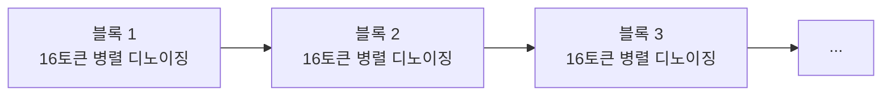
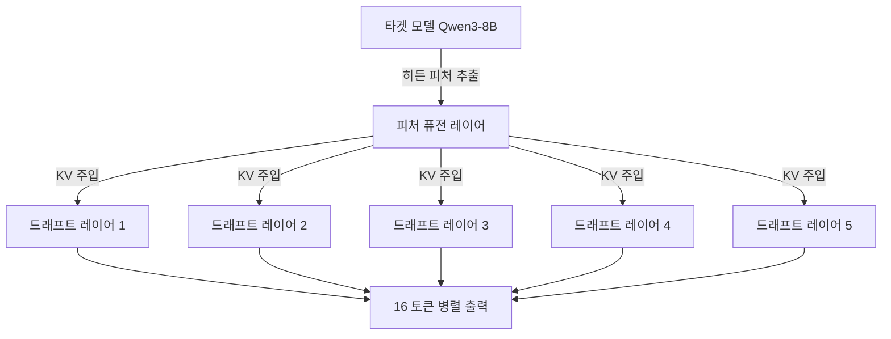

## 요약

2026년 2월 5일 공개된 DFlash는 **블록 디퓨전 모델을 투기적 디코딩(speculative decoding)의 드래프터로 활용**하여, 기존 자기회귀(AR) LLM 추론을 **최대 6.17배 무손실(lossless) 가속**하는 프레임워크다. 기존 최강 투기적 디코딩 기법인 EAGLE-3 대비 약 **2.5배 추가 속도 향상**을 달성했다. 논문은 arXiv:2602.06036, 코드는 [GitHub z-lab/dflash](https://github.com/z-lab/dflash)에 공개되어 있다.

---

## 1. 배경: 왜 LLM 추론이 느린가

### 자기회귀 디코딩의 한계

대형 언어 모델(LLM)은 토큰을 하나씩 순차적으로 생성하는 **자기회귀(autoregressive) 디코딩** 방식을 사용한다. 각 토큰 생성 시 이전 모든 토큰의 컨텍스트가 필요하기 때문에, 아무리 강력한 GPU를 사용해도 병렬화가 근본적으로 제한된다. 특히 최근 Chain-of-Thought(CoT) 추론 모델이 등장하면서, 수천~수만 토큰의 "생각 과정"을 출력해야 하는 상황이 빈번해지며 이 병목은 더욱 심각해졌다.

### 투기적 디코딩: 기존 해법

**투기적 디코딩(Speculative Decoding)**은 이 문제를 완화하는 대표적 기법이다. 작동 원리는 간단하다:

1. 가볍고 빠른 **드래프트 모델**이 여러 토큰을 "추측"으로 미리 생성한다.
2. 무거운 **타겟 모델**이 이 추측된 토큰들을 **병렬로 검증**한다.
3. 검증을 통과한 토큰은 그대로 채택, 실패한 토큰부터는 타겟 모델이 직접 생성한다.

이 방식의 핵심 장점은 **무손실(lossless)** — 최종 출력이 타겟 모델 단독 생성과 수학적으로 동일한 분포를 보장한다는 것이다.

EAGLE 시리즈(EAGLE-1, 2, 3)와 Medusa 등이 이 분야를 이끌어왔지만, 공통적인 한계가 있었다: **드래프트 모델 자체가 여전히 자기회귀적**이라는 점이다. 즉 드래프트도 순차 생성이므로, 추측 토큰 수(γ)가 늘어나면 드래프팅 비용도 선형으로 증가한다.

```
T_draft = γ × t_step  (자기회귀 드래프트: 선형 증가)
```

EAGLE-3 같은 최신 기법도 실질적 가속은 **2~3배**에 머물렀다.

---

## 2. 블록 디퓨전이란 무엇인가

### 디퓨전 언어 모델(dLLM)

디퓨전 언어 모델은 이미지 생성 분야의 디퓨전 기법을 텍스트에 적용한 것이다. 마스크된(가려진) 토큰 위치들을 **동시에** 디노이징(복원)하여 병렬 텍스트 생성이 가능하다. LLaDA가 이 방향의 선구 모델로, 수십억 파라미터 규모에서 LLaMA-3.1-8B에 근접하는 성능을 보였다.

### 블록 디퓨전: 디퓨전 + 자기회귀의 하이브리드

**블록 디퓨전(Block Diffusion)**은 시퀀스 전체를 한번에 디퓨전하는 대신, **블록 단위**(예: 16토큰)로 나누어 각 블록 내부는 병렬 디퓨전, 블록 간에는 순차적으로 처리하는 하이브리드 방식이다.



이 접근법의 장점:
- **블록 내부**: 모든 토큰이 양방향(bidirectional) 어텐션으로 서로를 참조하며 동시 생성
- **블록 간**: KV 캐시를 활용한 효율적 순차 처리
- **고정 길이 문제 해결**: 전체 디퓨전과 달리 가변 길이 생성 가능

하지만 기존 블록 디퓨전 모델들은 단독으로는 자기회귀 모델 대비 **품질이 떨어지고**, 충분한 품질을 위해 많은 디노이징 스텝이 필요하여 속도 이점이 상쇄되는 문제가 있었다.

---

## 3. DFlash의 핵심 아이디어

DFlash의 핵심 통찰은 간결하다: **"타겟 모델이 가장 잘 안다(The target knows best)."**

기존 디퓨전 기반 드래프터들의 문제는 작은 모델이 "처음부터(from scratch)" 미래 토큰을 예측해야 한다는 것이었다. DFlash는 이를 완전히 뒤집는다.

### 3.1 컨텍스트 피처 주입 (KV Injection)

DFlash의 가장 중요한 설계 결정:

1. 타겟 모델이 prefill 단계에서 생성하는 **히든 스테이트(hidden representations)**를 추출한다
2. 얕은 층부터 깊은 층까지 균일하게 선택한 5개 레이어에서 추출
3. 경량 프로젝션 레이어로 퓨전하여 **컴팩트한 컨텍스트 피처**로 변환
4. 이 피처를 드래프트 모델 **모든 레이어의 Key-Value 캐시에 직접 주입**



이것이 EAGLE-3와의 결정적 차이점이다:

| 설계 요소 | EAGLE-3 | DFlash |
|-----------|---------|--------|
| 드래프트 방식 | 자기회귀 (순차) | 블록 디퓨전 (병렬) |
| 타겟 피처 활용 | 입력 임베딩에만 퓨전 | 모든 레이어 KV 캐시에 주입 |
| 드래프트 비용 | γ × t_step (선형) | t_parallel (상수에 가까움) |
| 레이어 수 | 1 레이어 | 5 레이어 (더 깊어도 가능) |
| 피처 희석 문제 | 깊은 레이어에서 희석 | 매 레이어 재주입으로 유지 |

### 3.2 왜 6배 가속이 가능한가

DFlash의 6배 가속은 두 가지 요인의 시너지다:

**요인 1: 낮은 드래프팅 지연시간**

디퓨전 드래프터는 16개 토큰을 **단일 포워드 패스**로 생성한다. EAGLE-3의 1-레이어 모델이 8개 토큰을 7번의 순차 패스로 생성하는 것과 비교하면, DFlash의 5-레이어 모델이 16개 토큰을 생성하면서도 **더 낮은 지연시간**을 달성한다.

```
DFlash: T_draft = t_parallel (단일 패스, GPU 병렬 활용 극대화)
EAGLE-3: T_draft = 7 × t_step (7번의 순차 패스)
```

**요인 2: 높은 수락 길이(acceptance length)**

KV 주입 덕분에 5-레이어 드래프트 모델이 타겟 모델의 "의도"를 정확히 파악한다:

| 모델 | 방법 | 평균 수락 길이 (τ) |
|------|------|-------------------|
| Qwen3-8B | EAGLE-3 (tree 16) | 2.96 |
| Qwen3-8B | EAGLE-3 (tree 60) | 3.40 |
| Qwen3-8B | **DFlash (block 16)** | **6.49** |

수락 길이가 2배 이상이면서 드래프팅 비용이 더 낮으니, 복합적으로 6배 가속이 나오는 것이다.

### 3.3 무손실(Lossless) 보장 메커니즘

DFlash의 "무손실"은 **투기적 디코딩의 검증 단계**에 의해 수학적으로 보장된다:

1. 드래프트 모델이 γ개의 토큰을 제안
2. 타겟 모델이 이 γ개를 **한 번의 포워드 패스**로 병렬 검증
3. 타겟 모델의 출력 분포와 일치하는 토큰만 채택
4. 첫 번째 불일치 토큰부터는 타겟 모델이 직접 생성 (보너스 토큰 포함)

이 검증 과정은 드래프트 모델의 품질과 **무관하게** 최종 출력의 정확성을 보장한다. 드래프트가 아무리 엉터리여도 최종 출력은 타겟 모델 단독 생성과 동일하다 — 다만 속도가 느려질 뿐이다. 이것이 투기적 디코딩의 핵심 이론적 보장이다.

---

## 4. 실험 결과 상세 분석

### 4.1 Transformers 백엔드 (단일 요청)

Qwen3-8B, 온도=0(그리디 디코딩):

| 벤치마크 | EAGLE-3 (16) | EAGLE-3 (60) | DFlash (16) |
|----------|:------------:|:------------:|:-----------:|
| GSM8K | 1.94× | 2.23× | **5.15×** |
| MATH-500 | 1.81× | 2.05× | **6.08×** |
| AIME25 | 1.79× | 2.05× | **5.62×** |
| HumanEval | 1.89× | 2.17× | **5.14×** |
| MBPP | 1.69× | 1.93× | **4.65×** |
| LiveCodeBench | 1.57× | 1.81× | **5.51×** |
| MT-Bench | 1.63× | 1.90× | **2.75×** |
| **평균** | **1.76×** | **2.02×** | **4.86×** |

주목할 점:
- **수학/코드 태스크**에서 5~6배 가속으로 압도적
- **대화(MT-Bench)**에서는 2.75배로 상대적으로 낮음 — 대화는 예측 가능한 패턴이 적기 때문
- 온도=1(샘플링)에서도 4.03배 평균 가속 유지

### 4.2 SGLang 서빙 프레임워크 (실전 배포)

실제 서빙 환경에서의 결과가 더 의미 있다. B200 GPU, FlashAttention-4 백엔드:

| 모델 | 태스크 | 동시성 1 | 동시성 8 | 동시성 32 |
|------|--------|:--------:|:--------:|:---------:|
| Qwen3-4B | Math500 | 4.8× | 4.1× | 2.9× |
| Qwen3-8B | Math500 | 5.1× | 4.5× | 2.8× |
| Qwen3-8B | HumanEval | 4.2× | 3.6× | 2.4× |
| Qwen3-Coder-30B-A3B | HumanEval | 3.5× | 3.2× | 3.1× |

동시성이 높아질수록 가속 비율이 줄어드는 것은 자연스럽다 — GPU 연산 자원이 나뉘면서 병렬 드래프팅의 이점이 상대적으로 줄어들기 때문이다. 하지만 동시성 32에서도 **2.4~3.1배**를 유지한다는 것은 실전 서빙에서도 충분히 의미 있는 수치다.

### 4.3 추론(Reasoning) 모드

Qwen3 모델의 thinking 모드를 활성화한 경우에도:

| 모델 | 온도 | GPQA | MATH-500 | AIME25 |
|------|:----:|:----:|:--------:|:------:|
| Qwen3-4B | 0 | 4.23× | 4.59× | 4.39× |
| Qwen3-8B | 0 | 4.17× | 4.64× | 4.51× |

추론 모델은 수천 토큰의 "생각 과정"을 출력하므로 가속의 실질적 가치가 매우 크다. 10초 걸리던 추론이 2.2초로 줄어드는 것이다.

---

## 5. 기술적 세부 사항

### 5.1 드래프트 모델 아키텍처

- **파라미터**: 타겟 모델 대비 매우 경량 (5-레이어 트랜스포머)
- **블록 크기**: 16 (Qwen3 모델), 10 (LLaMA-3.1)
- **공유 구성요소**: 토큰 임베딩과 LM 헤드를 타겟 모델과 공유 (학습 시 동결)
- **학습 가능 파라미터**: 드래프트 트랜스포머 레이어 + 피처 프로젝션 레이어만

### 5.2 학습 방법론

DFlash의 학습에는 몇 가지 핵심 기법이 사용된다:

**랜덤 앵커 샘플링**: 표준 블록 디퓨전처럼 균일 분할 대신, 응답에서 랜덤하게 앵커 토큰을 선택하고 이를 블록 시작으로 사용한다. 이는 추론 시의 행동(이전 검증에서 나온 보너스 토큰이 앵커가 됨)과 정확히 일치한다.

**손실 가중치**: 블록 내 초기 위치의 에러가 후속 모든 토큰을 무효화하므로, 지수 감소 가중치를 적용한다:

$$w_k = \exp\left(-\frac{k-1}{\gamma}\right)$$

초기 위치에 더 높은 가중치를 부여하여 수락 길이를 극대화한다.

**효율적 장문맥 학습**: 시퀀스당 마스크 블록 수를 고정하고 에포크마다 앵커를 랜덤 리샘플링하여, 데이터 증강 효과와 학습 비용 절감을 동시에 달성한다.

### 5.3 Ablation 결과 요약

| 설계 선택 | 최적값 | 이유 |
|-----------|--------|------|
| 드래프트 레이어 수 | 5 | 수락 길이↑ vs 드래프팅 비용↑의 최적 균형점 |
| 타겟 히든 피처 수 | 5개 레이어 | 3→5로 늘리면 수락 길이 명확히 증가 |
| 블록 크기 | 16 | 8은 35.7%가 전체 수락(과소 활용), 16이 효율적 |
| 학습-추론 블록 크기 | 일치 권장 | 큰→작은은 일반화 가능, 역방향은 성능 저하 |

---

## 6. 지원 모델 및 하드웨어 요구사항

### 현재 지원 모델

| 모델 | HuggingFace 드래프트 모델 |
|------|--------------------------|
| Qwen3-4B | z-lab/Qwen3-4B-DFlash-b16 |
| Qwen3-8B | z-lab/Qwen3-8B-DFlash-b16 |
| Qwen3-Coder-30B-A3B | z-lab/Qwen3-Coder-30B-A3B-DFlash |
| LLaMA-3.1-8B-Instruct | z-lab/LLaMA3.1-8B-Instruct-DFlash-UltraChat |

### 예정 모델 (Coming Soon)

- openai/gpt-oss-20b, openai/gpt-oss-120b
- zai-org/GLM-4.7, GLM-4.7-Flash
- Qwen/Qwen3-Coder-Next

### 하드웨어 요구사항

**필수 요건:**
- **NVIDIA GPU**: H200 또는 B200에서 벤치마크됨
- **CUDA 지원**: `device_map="cuda:0"` 필수
- **bfloat16 지원**: dtype="auto" → bfloat16
- **충분한 VRAM**: 타겟 모델 + 드래프트 모델 동시 로드 필요
  - Qwen3-8B + DFlash: 약 20GB+ VRAM 추정
  - Qwen3-Coder-30B-A3B + DFlash: 약 15GB+ (MoE이므로 활성 파라미터 적음)

**프레임워크 요건:**
- SGLang (최적): FlashAttention-3/4 백엔드, Spec-v2 스케줄링
- Transformers: PyTorch 2.9.0 + transformers 4.57.3
- flash-attn (선택): 없으면 torch.sdpa 폴백 (속도 저하, 수락 길이는 유지)

---

## 7. 우리 인프라 적용성 평가

### 7.1 MiniPC (Linux, GPU 없음) — ❌ 불가

DFlash는 CUDA GPU가 **필수**다. CPU에서의 추론은 지원되지 않으며, 설령 가능하더라도 투기적 디코딩의 핵심 전제인 "병렬 검증이 순차 생성보다 빠름"이 CPU에서는 성립하지 않는다. MiniPC에서의 적용은 불가능하다.

### 7.2 Mac Studio (M-series) — ⚠️ 현재 불가, 이론적 가능성 있음

현재 코드는 `device_map="cuda:0"`로 하드코딩되어 있으며, MPS(Metal Performance Shaders) 지원이 없다. 하지만:

- Apple Silicon의 통합 메모리 아키텍처는 대형 모델 로드에 유리
- MLX 프레임워크가 투기적 디코딩을 지원하기 시작함
- DFlash의 핵심 알고리즘은 GPU 아키텍처에 종속적이지 않음

**MLX 포팅이 이루어진다면** Mac Studio M-series에서도 의미 있는 가속이 가능할 수 있다. 다만 현재는 NVIDIA CUDA 전용이다.

### 7.3 OpenClaw/LLM 추론 — ⚠️ 간접 적용 가능성

OpenClaw의 현재 LLM 추론 파이프라인은 **API 기반**(Anthropic Claude, OpenAI 등)이므로 DFlash를 직접 적용할 수 없다. 하지만 다음 시나리오에서는 관련성이 있다:

1. **로컬 LLM 서빙으로 전환 시**: Qwen3-8B 같은 오픈소스 모델을 자체 서빙한다면, DFlash로 5배 가속이 가능
2. **비용 최적화**: API 비용 절감을 위해 로컬 추론으로 전환 검토 시 핵심 기술
3. **GCP VM 활용**: 현재 GCP VM(34.19.69.41)에 NVIDIA GPU를 추가하면 즉시 적용 가능

---

## 8. 기존 기법과의 비교 정리

| 기법 | 드래프트 방식 | 가속 배율 | 드래프트 크기 | 무손실 | 비고 |
|------|-------------|:---------:|:------------:|:------:|------|
| Medusa | AR 멀티헤드 | 2~2.5× | 헤드만 추가 | ✅ | 트리 어텐션 |
| EAGLE-1/2 | AR 1레이어 | 2~3× | 매우 경량 | ✅ | 히든 스테이트 활용 |
| EAGLE-3 | AR 1레이어 | 2~3× | 매우 경량 | ✅ | 개선된 학습 목표 |
| DiffuSpec | 디퓨전 7B | 3~4× | 매우 큼 | ✅ | 메모리 부담 |
| PARD | AR→디퓨전 모방 | ~3× | 경량 | ✅ | 수락 길이 한계 |
| **DFlash** | **블록 디퓨전 5L** | **4~6×** | **경량** | **✅** | **KV 주입이 핵심** |

DFlash가 달성한 것은 **경량성과 고품질의 양립**이다. 기존에는 "작은 드래프터 = 낮은 수락률"이 공식이었지만, KV 주입을 통해 이 공식을 깨뜨렸다.

---

## 9. 한계와 제약사항

### 기술적 한계

1. **NVIDIA GPU 전용**: CUDA 의존성. AMD, Intel, Apple Silicon 미지원
2. **타겟 모델 의존적**: 각 타겟 모델마다 별도의 DFlash 드래프트 모델을 학습해야 함
3. **학습 데이터 필요**: 약 800K 샘플로 학습 (타겟 모델로 생성한 응답 필요)
4. **동시성 증가 시 효과 감소**: 동시 요청 32개에서는 2.4~3.1배로 감소
5. **대화 태스크**: 수학/코드 대비 효과가 상대적으로 낮음 (2.75배 vs 5~6배)

### 생태계 한계

1. **SGLang에만 통합**: vLLM 통합은 진행 중
2. **학습 레시피 미공개**: "곧 공개" 상태 — 자체 모델 학습 불가
3. **제한된 모델 지원**: 현재 4개 모델만 드래프트 모델 제공
4. **배치 서빙 최적화 부족**: 단일 요청에서 최적, 대규모 배치 시 효과 검증 필요

---

## 10. 결론 및 판정: 🟡 관망(Watch)

### 판정 근거

| 평가 항목 | 점수 | 이유 |
|-----------|:----:|------|
| 기술적 혁신성 | ⭐⭐⭐⭐⭐ | 블록 디퓨전 + KV 주입의 조합은 진정한 패러다임 전환 |
| 실용적 가속 효과 | ⭐⭐⭐⭐⭐ | 6배 무손실 가속은 압도적 |
| 우리 인프라 적합성 | ⭐ | NVIDIA GPU 필수, API 기반 파이프라인과 무관 |
| 즉시 적용 가능성 | ⭐ | 현재 환경에서 직접 활용 불가 |
| 미래 관련성 | ⭐⭐⭐⭐ | 로컬 LLM 서빙 전환 시 핵심 기술 |

### 최종 판정: 🟡 관망(Watch and Wait)

DFlash는 **LLM 추론 가속 분야의 중요한 돌파구**다. 블록 디퓨전을 투기적 디코딩에 결합한 아이디어는 우아하고, 6배 무손실 가속이라는 결과는 인상적이다. 특히 추론(reasoning) 모델의 긴 출력을 가속하는 데 매우 효과적이어서, CoT 시대의 핵심 인프라 기술이 될 가능성이 높다.

그러나 **현재 우리 인프라(API 기반 추론, NVIDIA GPU 없음)**에서는 직접 적용할 수 없다. 다음 상황에서 재평가해야 한다:

1. **로컬 LLM 서빙 도입 검토 시** → DFlash는 1순위 적용 기술
2. **MLX 포팅이 이루어질 때** → Mac Studio에서의 가능성 재평가
3. **학습 레시피 공개 시** → 커스텀 모델 지원 가능성 확인
4. **vLLM 통합 완료 시** → 더 넓은 생태계 지원 확인

**기억해둘 핵심**: 만약 NVIDIA GPU가 있는 환경에서 Qwen3-8B를 서빙한다면, DFlash를 켜는 것만으로 **같은 하드웨어에서 5배 더 많은 요청을 처리**할 수 있다. 이것은 서빙 비용을 80% 절감하는 것과 같다.

---

## 참고 자료

- **논문**: [arXiv:2602.06036](https://arxiv.org/abs/2602.06036) — "DFlash: Block Diffusion for Flash Speculative Decoding"
- **코드**: [github.com/z-lab/dflash](https://github.com/z-lab/dflash)
- **모델**: [HuggingFace z-lab 컬렉션](https://huggingface.co/collections/z-lab/dflash)
- **저자**: Jian Chen, Yesheng Liang, Zhijian Liu (z-lab)
- **관련 논문**:
  - EAGLE-3: [arXiv:2503.01840](https://arxiv.org/abs/2503.01840)
  - LLaDA: [arXiv:2502.09992](https://arxiv.org/abs/2502.09992)
  - Block Diffusion: [arXiv:2503.09573](https://arxiv.org/abs/2503.09573)
